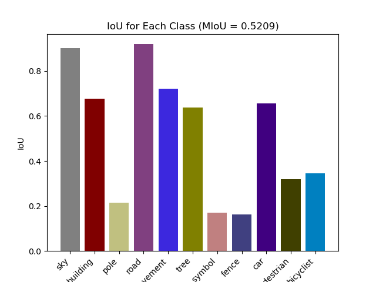
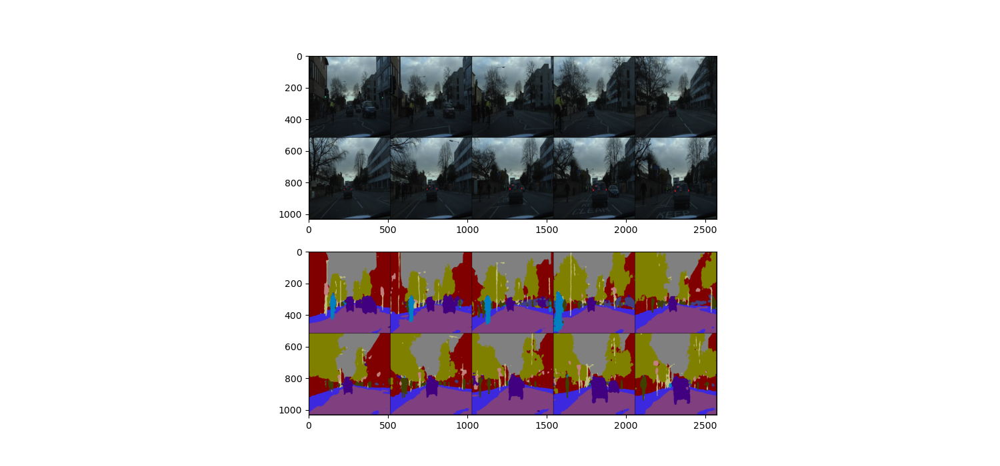
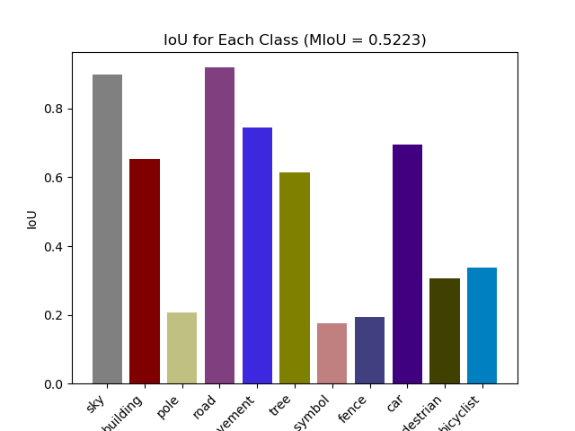
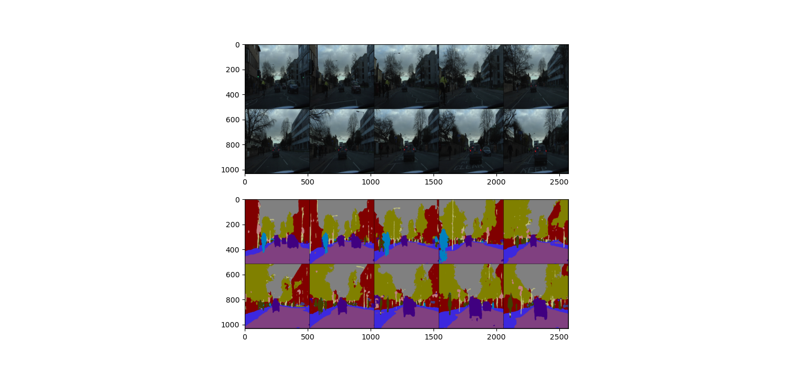

## Abstract

This project presents a comprehensive solution for road scene detection during driving, motivated by the necessity for real-time capture of road events to ensure secure navigation. The study emphasizes the enhancement of autonomous vehicle safety through the accurate identification of road elements. Leveraging the ENet architecture—a well-established deep learning model for pixel-wise semantic segmentation—the research introduces novel improvements, including the replacement of the activation function with Mish and the incorporation of Self-Attention Distillation (SAD). These enhancements are systematically evaluated using the Cambridge-driving Labeled Video Database (CamVid), a widely recognized dataset for evaluating road object classification.

The results demonstrate the impact of these modifications on segmentation performance. Comparative analysis using Intersection over Union (IoU) and average IoU metrics reveals significant improvements. The IoU test results for three different models are shown below:

### 1. IoU Test Result for ENet with Mish and SAD (200 epochs):

#### Visualization Result for ENet with Mish and SAD:

### 2. IoU Test Result for Original ENet (200 epochs):

#### Visualization Result for Original ENet:

### Table 2: Results on CamVid Test Set (IoU Value for Each Class)

| Model              | Sky   | Building | Pole  | Road  | Pavement | Tree  | Symbol | Fence | Car   | Pedestrian | Bicyclist |
|--------------------|-------|----------|-------|-------|----------|-------|--------|-------|-------|------------|-----------|
| **ENet**           | 89.92 | 65.25    | 20.72 | 91.92 | **74.56**    | 61.48 | **17.50**  | **19.42** | **69.43** | 30.60      | 33.69     |
| **ENet+Mish+SAD**  | **90.24** | **67.71**    | **21.60** | **91.94** | 72.27    | **63.70** | 17.09  | 16.33 | 65.68 | **31.95**      | **34.45**     |

The comparative analysis conclusively shows that the integration of Mish and SAD enhances the performance of ENet, particularly in terms of average IoU across different classes
